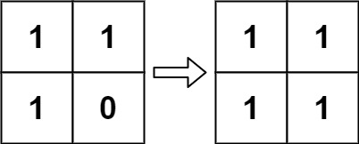

## [289. Game of Life](https://leetcode.com/problems/game-of-life/)

### 1. Description

> According to Wikipedia's article: "The Game of Life, also known simply as Life, is a cellular automaton devised by the British mathematician John Horton Conway in 1970."

The board is made up of an $m \times n$ grid of cells, where each cell has an initial state: live (represented by a `1`) or dead (represented by a `0`). Each cell interacts with its eight neighbors (horizontal, vertical, diagonal) using the following four rules (taken from the above Wikipedia article):

1. Any live cell with fewer than two live neighbors dies as if caused by under-population.
2. Any live cell with two or three live neighbors lives on to the next generation.
3. Any live cell with more than three live neighbors dies, as if by over-population.
4. Any dead cell with exactly three live neighbors becomes a live cell, as if by reproduction.

The next state is created by applying the above rules simultaneously to every cell in the current state, where births and deaths occur simultaneously. Given the current state of the $m \times n$ grid `board`, return the next state.

**Example 1:**


```
Input: board = [[0,1,0],[0,0,1],[1,1,1],[0,0,0]]
Output: [[0,0,0],[1,0,1],[0,1,1],[0,1,0]]
```

**Example 2:**



```
Input: board = [[1,1],[1,0]]
Output: [[1,1],[1,1]]
```

**Constraints:**

- `m == board.length`
- `n == board[i].length`
- `1 <= m`, `n <= 25`
- `board[i][j]` is `0` or `1`.

**Follow up:**

Could you solve it in-place? Remember that the board needs to be updated simultaneously: You cannot update some cells first and then use their updated values to update other cells.
In this question, we represent the board using a 2D array. In principle, the board is infinite, which would cause problems when the active area encroaches upon the border of the array (i.e., live cells reach the border). How would you address these problems?


### 2. Solutions

#### Solution 1: `Language: Java` Temporary Grid and Calculation of Neighbours

> Task 1 of Lab 05, Course COMP2511 21T2, University of New South Wales

We need to create a temporary grid because we need to update the board **simultaneously**.

- Wednesday, 28 July, 2021
- Time Complexity: $O(m \times n)$
- Space Complexity: $O(m \times n)$
- *Runtime: 0 ms, faster than 100.00% of Java online submissions for Game of Life.*
- *Memory Usage: 37.3 MB, less than 78.25% of Java online submissions for Game of Life.*

```Java
class Solution {
    /**
     * Java solution for LeetCode problem No.289
     * Game of Life
     * 28 July, 2021
     * @author Hao Ren, hao.ren@student@unsw.edu.au
     */
    private int size_row;
    private int size_col;

    private int countNeighbours(int[][] board, int x, int y) {
        /**
         * Helper function which MUST run with gameOfLife().
         */
        int count = 0;
        int up = x - 1;
        int down = x + 1;
        int left = y - 1;
        int right = y + 1;

        if (up >= 0 && left >= 0 && board[up][left] == 1) count++;
        if (up >= 0 && y >= 0 && y <= size_col - 1 && board[up][y] == 1) count++;
        if (up >= 0 && right <= size_col - 1 && board[up][right] == 1) count++;
        if (x >= 0 && x <= size_row - 1 && left >= 0 && board[x][left] == 1) count++;
        if (x >= 0 && x <= size_row - 1 && right <= size_col - 1 && board[x][right] == 1) count++;
        if (down <= size_row - 1 && left >= 0 && board[down][left] == 1) count++;
        if (down <= size_row - 1 && y >= 0 && y <= size_col - 1 && board[down][y] == 1) count++;
        if (down <= size_row - 1 && right <= size_col - 1 && board[down][right] == 1) count++;

        return count;

    }

    public void gameOfLife(int[][] board) {
        this.size_row = board.length;
        this.size_col = board[0].length;
        int[][] next = new int[size_row][size_col];
        for (int i = 0; i < size_row; i++) {
            for (int j = 0; j < size_col; j++) {
                next[i][j] = board[i][j];
            }
        }

        for (int r = 0; r < size_row; r++) {
            for (int c = 0; c < size_col; c++) {
                int neighbours = countNeighbours(board, r, c);
                if (board[r][c] == 1 && neighbours < 2) {
                    next[r][c] = 0;
                } else if (board[r][c] == 1 && neighbours > 3) {
                    next[r][c] = 0;
                } else if (board[r][c] == 1 && (neighbours == 2 || neighbours == 3)) {
                    next[r][c] = 1;
                } else if (board[r][c] != 1 && neighbours == 3) {
                    next[r][c] = 1;
                } else {
                    next[r][c] = board[r][c];
                }
            }
        }

        for (int m = 0; m < size_row; m++) {
            for (int n = 0; n < size_col; n++) {
                board[m][n] = next[m][n];
            }
        }
    }
}

```
